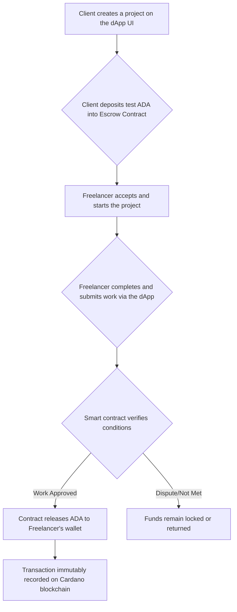

# 💸 Decentralized Freelancer Payments dApp on Cardano (CREDENZA)

A **trustless escrow system** built on the **Cardano blockchain** to secure payments for freelancers and clients, eliminating delays, high fees, and counterparty risk.

---

## 📖 Table of Contents
- [❗ Problem Statement](#-problem-statement)
- [💡 Our Solution](#-our-solution)
- [🔄 How It Works](#-how-it-works)
- [⚙️ Tech Stack](#️-tech-stack)
- [✨ Features](#-features)
- [📂 Folder Structure](#-folder-structure)
- [🚀 Getting Started](#-getting-started)
  - [Prerequisites](#prerequisites)
  - [Installation](#installation)
- [🧪 Running the Demo](#-running-the-demo)
- [🤝 Contributing](#-contributing)
- [📄 License](#-license)

---

## ❗ Problem Statement
Freelancers worldwide often struggle with **payment uncertainties**.  
Issues include:
- ⏳ **Delayed payments**  
- 🚫 **Scams and fraud**  
- 💰 **High commission fees** from centralized platforms  

Clients also face risks, with **no guarantees of delivery or quality** after paying upfront.

---

## 💡 Our Solution
This project introduces a **decentralized application (dApp)** that acts as a **secure escrow service** on the **Cardano Testnet**.

✅ Built with **Aiken smart contracts**  
✅ Funds are **locked on-chain** until conditions are met  
✅ **Automatic enforcement** of agreements  
✅ **Fairness, transparency, and security** for both freelancers and clients  

---

## 🔄 How It Works
The entire process is automated via a **smart contract**, with no central authority involved.



---

## ⚙️ Tech Stack
| **Category**   | **Technology**             | **Description** |
|----------------|-----------------------------|-----------------|
| Blockchain     | Cardano                    | Proof-of-stake blockchain platform |
| Smart Contract | Aiken                      | Modern Cardano smart contract language |
| Frontend       | React.js + Mesh.js         | UI & wallet interactions |
| Blockchain API | Blockfrost API             | Access Cardano blockchain data |
| Currency       | ADA (tADA)                 | Native Cardano currency |
| Wallets        | Nami, Eternl, Lace         | Testnet-compatible wallets |
| Ledger Model   | UTXO                       | Cardano’s transaction model |

---

## ✨ Features
### 🔐 Escrow Smart Contract (Aiken)
- `deposit()`: Client deposits ADA  
- `submitWork()`: Freelancer submits work  
- `releaseFunds()`: Client approves → ADA released  

### 🔗 Blockchain Interaction (Blockfrost API)
- Query escrow balance & UTXOs  
- Submit deposit/release transactions  
- Track all state changes on-chain  

### 💻 Frontend UI (React + Mesh.js)
- Wallet integration (Nami, Eternl, Lace)  
- Actions: Create Project, Deposit ADA, Accept Project, Submit Work  
- Real-time project status, balances, and history  

### 🧪 Testnet Ready
- Works on **Cardano Preview Testnet**  
- End-to-end flow with free test ADA  
- Transactions verifiable on **Cardanoscan**  

---

## 📂 Folder Structure
```
freelance-dapp/
├── frontend/        # React.js + Mesh.js UI
│   ├── components/  # Reusable UI components
│   ├── services/    # API hooks & wallet logic
│   └── App.js       # Main app entry
├── contracts/       # Aiken smart contracts
│   └── escrow.aiken # Escrow contract logic
├── backend/         # (Optional) Blockfrost scripts
│   └── blockfrost.js
└── README.md        # Documentation
```

---

## 🚀 Getting Started
Follow these steps to set up and run the project locally.

### Prerequisites
- [Node.js](https://nodejs.org/) (v16+)
- [Git](https://git-scm.com/)
- Cardano Testnet Wallet (**Nami / Eternl / Lace**) with **test ADA**
- [Blockfrost API Key](https://blockfrost.io/) (Preview Testnet)

### Installation
```bash
# Clone repository
git clone https://github.com/your-username/freelance-dapp.git
cd freelance-dapp

# Setup environment
cd frontend
cp .env.example .env.local
# Add your Blockfrost API Key
REACT_APP_BLOCKFROST_API_KEY="YOUR_PREVIEW_TESTNET_API_KEY"

# Install frontend dependencies
npm install
```

### Compile Smart Contract
Use **Aiken CLI** to compile `escrow.aiken` into `plutus.json`.  
Place it in `frontend/src/contracts` for frontend usage.

---

## 🧪 Running the Demo
```bash
# Start development server
cd frontend
npm start
```
App runs at **http://localhost:3000**

### Demo Flow
1. **Get Test ADA** → Use [Cardano Faucet](https://docs.cardano.org/cardano-testnet/tools/faucet/)  
2. **Client Deposits** ADA into escrow  
3. **Freelancer Submits Work**  
4. **Client Releases Funds** → ADA sent to freelancer  
5. **Verify Transaction** → On [Cardanoscan Testnet Explorer](https://testnet.cardanoscan.io/)

---

## 🤝 Contributing
We welcome contributions!  
1. Fork the repo  
2. Create a feature branch (`git checkout -b feature/AmazingFeature`)  
3. Commit changes (`git commit -m 'Add feature'`)  
4. Push branch (`git push origin feature/AmazingFeature`)  
5. Open a Pull Request  

---

## 📄 License
Distributed under the **MIT License**. See [`LICENSE`](LICENSE) for details.
